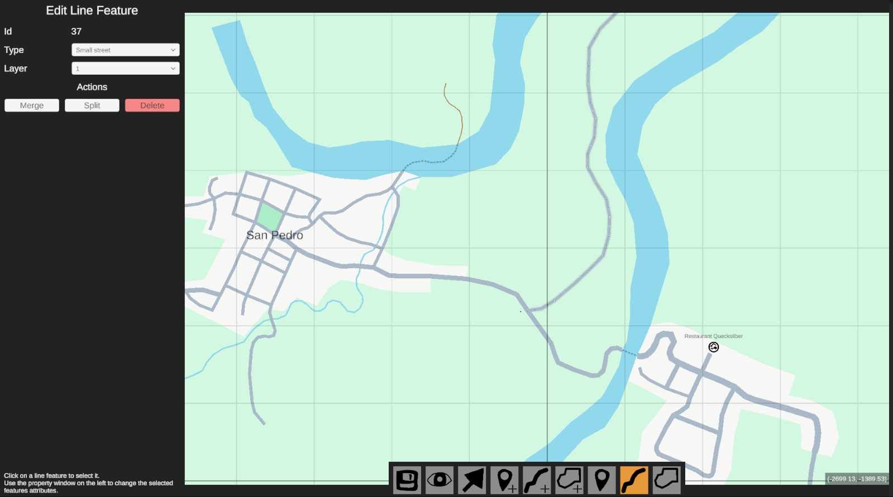

# GameGeoMapsFramework
A Unity framework to easily create and edit maps, with features useful in games.

The frameworks core mechanics are rooted in standard GIS concepts, where a map is basically just a collection of point, line and area features, which can each have individual attributes and can share points to create a graph network.

# Screenshots

  
_Map Editor showing a map created with this framework_